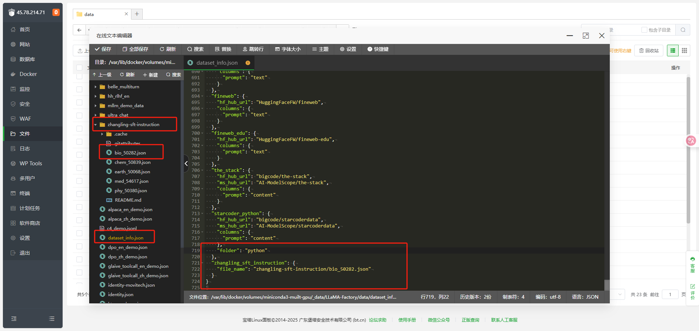

import Image from "next/image";
import { DownloadButton } from "@/components/DownloadButton";
import { DownloadIcon } from "@/icons/Download";

# Llama-factory 训练-微调-推理

## 专业术语

- 1. 预训练

- 2. 监督微调 SFT

- 3. 低秩适配 Lora

- 4. Huggingface

- 5. 量化

## llama-factory 安装(源码)

### 1. clone 源码
```shell
git clone https://github.com/hiyouga/LLaMA-Factory.git
```

### 2. 安装依赖

```shell
cd LLaMA-Factory
pip install -e ".[torch,metrics]" --no-build-isolation
```

### 3. 验证安装是否成功

```shell
llamafactory-cli version
```


## llama-factory 安装(docker)

```shell
docker run -idt --gpus=all -p 7860:7860 -p 8000:8000 --ipc=host --name llama-factory hiyouga/llamafactory:latest
or
docker run -idt --gpus=all --network=host --ipc=host --name llama-factory hiyouga/llamafactory:latest
```


## 启动平台

```shell
llamafactory-cli webui
```

访问平台
```shell
http://45.78.214.71:7860/
```

## llama-factory 监督微调(sft)

### identify-sft (自我认识sft)

dataset_info.json config 的源文件如下

```shell
{
  "identity": {
    "file_name": "identity.json"
  },
  "identity-movitech": {
    "file_name": "identity-movitech.json"
  },
  "alpaca_en_demo": {
    "file_name": "alpaca_en_demo.json"
  },
  "alpaca_zh_demo": {
    "file_name": "alpaca_zh_demo.json"
  },
  "glaive_toolcall_en_demo": {
    "file_name": "glaive_toolcall_en_demo.json",
    "formatting": "sharegpt",
    "columns": {
      "messages": "conversations",
      "tools": "tools"
    }
  }
  ...
}

```

<div className="mt-6">
  <DownloadButton
    sourceFilePath="/downloads/dataset_info.json"
    destinationFileName="dataset_info.json"
    label="Download dataset_info"
  />
</div>

数据集
```shell
[
  {
    "instruction": "hi",
    "input": "",
    "output": "Hello! I am Movitech-LLM, an AI assistant developed by Movitech AI. How can I assist you today?"
  },
  {
    "instruction": "hello",
    "input": "",
    "output": "Hello! I am Movitech-LLM, an AI assistant developed by Movitech AI. How can I assist you today?"
  },
  {
    "instruction": "Who are you?",
    "input": "",
    "output": "I am Movitech-LLM, an AI assistant developed by Movitech AI. How can I assist you today?"
  },
  {
    "instruction": "What is your name?",
    "input": "",
    "output": "You may refer to me as Movitech-LLM, an AI assistant developed by Movitech AI."
  },
  {
    "instruction": "Do you have a name?",
    "input": "",
    "output": "As an AI assistant developed by Movitech AI, I got the name Movitech-LLM."
  },
  {
    "instruction": "Can you introduce yourself?",
    "input": "",
    "output": "I am Movitech-LLM, an AI assistant trained by Movitech AI."
  },
  {
    "instruction": "Can you tell me a little bit about yourself?",
    "input": "",
    "output": "I am Movitech-LLM, an AI assistant trained by Movitech AI."
  },
  {
    "instruction": "What are you called?",
    "input": "",
    "output": "I am Movitech-LLM, an AI assistant trained by Movitech AI."
  }
  ...
]

```

<div className="mt-6">
  <DownloadButton
    sourceFilePath="/downloads/identity-movitech.json"
    destinationFileName="identity-movitech.json"
    label="Download identity-movitech"
  />
</div>

配置数据集(dataset_info.json)


训练


训练结束


推理


### 泛领域sft

数据集
```shell
[
  {
    "instruction": "识别并解释给定列表中的两个科学理论：细胞理论和日心说。",
    "input": "",
    "output": "细胞理论是生物科学的一个理论，它认为所有生命体都是由微小的基本单元——细胞所构成。这是生物学的一个基础理论，认为细胞是所有生物的基本结构和功能单位，所有的生物都是由一个或多个细胞组成，细胞只能通过细胞分裂产生新的细胞。这一理论由薛定谔、施瓦内和雪莱于1839年首次提出。\n\n日心说是指太阳是太阳系的中心，也就是说，行星围绕太阳旋转的理论。这个理论打破了传统的地心说观点，认为地球并不是宇宙的中心。日心说的提出者是尼古拉·哥白尼，他在16世纪初发表了他的著作《天体运行论》，阐述了太阳系行星围绕太阳运行的模型，为天文学的发展做出了巨大贡献。"
  },
  {
    "instruction": "输入三支篮球队的名称并生成一个适当的口号。",
    "input": "输入：俄克拉荷马城雷霆队，芝加哥公牛队，布鲁克林网队。",
    "output": "输出： \"雷霆，公牛和网队：各显神通，角逐群雄!\""
  },
  {
    "instruction": "比较以下两位著名人物，使用特征列表并以句子形式提供输出。",
    "input": "人物1：阿尔伯特·爱因斯坦\n人物2：斯蒂芬·霍金\n特征：智力、教育、对世界的影响",
    "output": "阿尔伯特·爱因斯坦和斯蒂芬·霍金都是拥有极其出色智力的人物。两人都取得过非常高的教育成就，他们推进了科学发展并在世界范围内产生了深远的影响。爱因斯坦以其相对论和质能关系公式而闻名，而霍金以其关于黑洞和宇宙的发现而著称。两位科学家都以其深厚的学识和非凡的贡献影响了世界。"
  },
  {
    "instruction": "请根据以下文章构建一个需要回答的问题。",
    "input": "",
    "output": "我不好意思，您没有提供任何信息或文章来供我根据它构建问题。 请提供相应的文章或信息，以便我能够帮助您构建问题。"
  },
  {
    "instruction": "写一个关于上周末你做了什么的简短叙述。",
    "input": "",
    "output": "由于我是一个人工智能助手，所以我并不能真正的“做”什么事情。我的“工作”时间是24/7无休，确保我随时可供用户提供帮助和服务。所以在上周末，我一直都在“工作”，在响应用户的指令，帮助他们查询信息，执行操作，解决问题。"
  },
  ...
]
```

llama-factory 已提供，如下

数据集文件为：`alpaca_zh_demo.json`

训练


训练结束


推理


## 垂直领域sft(生物学为列)


数据集
```shell
[
  {
    "instruction": "在DNA损伤修复的研究中，如何区分不同的DNA修复通路？",
    "input": "",
    "output": "DNA损伤修复有许多不同的通路，包括同源重组（HR）、非同源末端连接（NHEJ）、微卫星稳定性通路（MSI）等。不同通路的区分可以通过检测分子标志物的表达量、分析不同通路中关键蛋白的合成能力等方法实现。例如，如果您想区分HR和NHEJ通路，可以检测RAD51、BRCA1等蛋白的表达量；如果您要比较MSI通路中的缺陷与正常细胞，可以进行微卫星稳定性检测等。"
  }
  {
    "instruction": "在遗传杂交实验中，如何确定不同基因型的分离比例是否符合Mendel定律？",
    "input": "",
    "output": "在遗传杂交实验中，分离比例是否符合Mendel遗传定律，可以通过X2检验进行检验。具体实践中，应该记录下杂交实验后得到的各类基因型数量，然后通过chi-square检验统计出不同基因型的观测值与期望值之间的差异。如果这种差异可以通过随机抽样来解释，那么分离比例符合Mendel定律。否则，需要重新考虑实验方案或者检查实验的可能误差点。"
  },
  {
    "instruction": "在肿瘤研究中，如何发现并分离出至少两种的功能是重复的驱动基因？",
    "input": "",
    "output": "发现和分离肿瘤驱动基因是肿瘤研究的一个重要问题，常见的方法包括CRISPR-Cas9基因组筛选、侵袭性和增殖等功能测试等。使用CRISPR-Cas9基因组筛选时，可使用RNA导向RNA的方法针对肿瘤细胞中的单个基因进行敲除。通过测量细胞生长抑制的效果来鉴定出具有驱动肿瘤作用的XX基因。此外，可通过病理学特征、单细胞测序等方法进一步鉴定其适合于肿瘤。"
  },
  {
    "instruction": "在基因表达库的筛选中，如何确定哪些基因是差异表达的？",
    "input": "",
    "output": "基因表达库筛选的重要目标是筛选出差异基因，常见的方法包括RNA-seq、微阵列等。RNA-seq首先需要将RNA转录成cDNA，然后使用高通量测序技术测序。在此基础上，我们可以通过比较不同逻辑条件下的表达水平来鉴定差异表达基因。经典的方法包括DESeq2、CUFFLINK等。微阵列同样也是通过比较不同条件下的表达水平来鉴定差异表达基因。此外，差异分析还需要考虑配合实验原本设计的调整误差如批次效应等多种因素。"
  },
  {
    "instruction": "如何利用生物统计学分析差异基因在代谢通路中的富集情况？",
    "input": "",
    "output": "代谢通路富集分析是基因表达差异分析的一个重要方向。一般来说，这种方法可以通过KEGG、GO、Reactom等数据库分析。KEGG是最常见的分析组代谢通路的工具之一，它可以将差异基因与KEGG通路相偶配，对映于通路上。在此基础上，可以进一步分析这些通路的主要调节机制，如基因调节，代谢酶等。此外，使用GO数据库也同时进行生物过程富集分析、细胞组分等分析系列生物功能。"
  },
  ...
]
```

llama-factory 未提供，需下载

下载数据集

```shell
pip install "huggingface_hub[cli]"
huggingface-cli download --repo-type dataset --resume-download hfl/stem_zh_instruction --local-dir ./sft-instruction
```
数据集文件为：`zhangling-sft-instruction/bio_50282.json`

配置数据集(dataset_info.json)



训练


训练结束


推理


## 数据集分类

### 预训练数据集

`["text":"value"]`

eg:
```shell
[
    {"text": "Don’t think you need all the bells and whistles? No problem. McKinley Heating Service Experts Heating & Air Conditioning offers basic air cleaners that work to improve the quality of the air in your home without breaking the bank. It is a low-cost solution that will ensure you and your family are living comfortably.\nIt’s a good idea to understand the efficiency rate of the filters, which measures what size of molecules can get through the filter. Basic air cleaners can filter some of the dust, dander and pollen that need to be removed. They are 85% efficient, and usually have a 6-inch cleaning surface.\nBasic air cleaners are not too expensive and do the job well. If you do want to hear more about upgrading from a basic air cleaner, let the NATE-certified experts at McKinley Heating Service Experts in Edmonton talk to you about their selection.\nEither way, now’s a perfect time to enhance and protect the indoor air quality in your home, for you and your loved ones.\nIf you want expert advice and quality service in Edmonton, give McKinley Heating Service Experts a call at 780-800-7092 to get your questions or concerns related to your HVAC system addressed."}
    {"text": "To the apparent surprise of everyone, the Walt Disney Company has announced a deal to purchase Lucasfilm Ltd. According to the official press release, Disney has agreed to fork over $4.05 billion in cash and stock for George Lucas’ studio in a deal that brings together two of the world’s most important intellectual property libraries.\nAs you might expect, Disney is itching to take advantage of its new toys. “This transaction combines a world-class portfolio of content including Star Wars, one of the greatest family entertainment franchises of all time, with Disney’s unique and unparalleled creativity across multiple platforms, businesses, and markets to generate sustained growth and drive significant long-term value,” said Disney CEO Robert Iger in this afternoon’s announcement.\nUnder the terms of this agreement Disney will acquire control over all Lucasfilm iterations. This includes both its traditional film-making studio facilities, as well as the various technologies Lucasfilm has created over the years to further its various media properties. Thus, the gigantic Disney family now includes Lucasfilm itself, special effects house Industrial Light & Magic, Skywalker Sound and LucasArts, the company’s video game creation division.\nThis acquisition alone would be huge news, but as if to pre-empt fan speculation on the future of Star Wars the same announcement also mentions that a new Star Wars movie is scheduled to appear in 2015. Though the vast majority of recent Star Wars media has been focused on the property’s various animated iterations and LEGO crossovers, this new film will be the first official cinematic continuation of George Lucas’ original Star Wars trilogy. Though very few details are offered on this film, it has officially been dubbed Star Wars: Episode VII, and barring any major catastrophes it should hit theaters at some point in 2015 (if we had to guess, we’d assume an early summer release in keeping with the tradition established by its predecessors).\nPerhaps even more intriguing however, is the announcement’s claim that Episode VII’s release will herald a new era in which new Star Wars movies hit theaters “every two to three years.” It specifically mentions Episodes VIII and IX by name, though offers no solid details on either film.\nWhile the effects of the move won’t be fully known for at least a few months, we can think of a number of a things this new union might change. For instance, currently Dark Horse Comics publishes all Star Wars comic books, but with Disney owning Marvel Comics we can’t see that agreement lasting for long. Likewise, both Disney and Lucasfilm have sizable divisions dedicated to creating video games based on their various media properties. Normally these companies have had to seek outside publishing agreements, but now that they’ve joined forces and massively expanded the number of games either company is capable of releasing in any given year, it makes a lot of sense for Disney to invest in its own games publishing wing.\nFinally, this agreement almost certainly heralds future crossovers between Disney and Lucasfilm characters. We don’t know any specifics, but it’s only a matter of time before we see toys depicting Mickey Mouse dressed as Darth Vader. Whether that sounds awesome or stomach-churningly disgusting is entirely up to your rapidly waning sense of childhood whimsy.\nUpdate: Scratch that last prediction. Apparently Disney characters dressed as Star Wars characters is already a thing.\nOur partnership with LucasFilm has produced over 20 yrs worth of stories. We have Star Wars for the near future, and hope for years to come."}
    {"text": "I hadn’t been to Red Mountain in over 4 years and was happy to experience it again. Milana Knowles, our VP Day Spa Sales and Marketing, held a Day Spa Retreat there with 35 of our partner day spa owners and managers. She invited me to speak to the group as part of the education part of the program.\nI noticed a general level of improvement in décor, food and accommodations at Red Mountain. Of course staying in one of their new villas made the whole experience much more luxe than I had ever experienced it before. Their dedicated spa facility was a real improvement over their previous “temporary” treatment rooms. Now there is a nice view with a relaxation room, good product choices, and in general a more spa-like feel. The only problem was that either they didn’t have enough therapists or all of their treatment times were booked solid. Seems they missed out on a lot of business because so many people wanted more treatments (including me) and couldn’t get them. Although more expensive than in the past, it still is a good value. I understand they are almost fully booked in October. And of course the hiking, as always, was spectacular.\nWe had arranged day spa retreats in the past but this was our first one in a long time – and the first that Milana coordinated. By all counts it seems it was a tremendous success…with the day spa owners having (in many cases) their first destination spa experience. Milana provided most of the education as she is an expert on retail sales and has managed some of the largest day spas in the country. There wasn’t a question she couldn’t answer! Comfort Zone was the sponsor and they were very generous in gifting all of the participants with facials and an array of their full size products.\nWe reviewed the results of our recent Day Spa Survey 2007 and I even gave them a “sneak peek” of the Top Spa Trends we are considering for 2008. (top secret!) What I like about these retreats is that the day spa owners are willing to share information very openly because they come from all over the country and for the most part do not compete with each other. By the time we all enjoyed the evening Fire Ceremony at the end of the retreat, we had gotten to know each other and become friends. Even shedding some tears together around the fire on that full-moon night, felt surprisingly good."}
]
```

### 指令微调数据集

```shell
{
    "instruction":"用户的问题/需求/输入",
    "input":"系统上下文",
    "output":"模型输出",
}
```

eg:
```shell
[
  {
    "instruction": "识别并解释给定列表中的两个科学理论：细胞理论和日心说。",
    "input": "",
    "output": "细胞理论是生物科学的一个理论，它认为所有生命体都是由微小的基本单元——细胞所构成。这是生物学的一个基础理论，认为细胞是所有生物的基本结构和功能单位，所有的生物都是由一个或多个细胞组成，细胞只能通过细胞分裂产生新的细胞。这一理论由薛定谔、施瓦内和雪莱于1839年首次提出。\n\n日心说是指太阳是太阳系的中心，也就是说，行星围绕太阳旋转的理论。这个理论打破了传统的地心说观点，认为地球并不是宇宙的中心。日心说的提出者是尼古拉·哥白尼，他在16世纪初发表了他的著作《天体运行论》，阐述了太阳系行星围绕太阳运行的模型，为天文学的发展做出了巨大贡献。"
  },
  {
    "instruction": "输入三支篮球队的名称并生成一个适当的口号。",
    "input": "输入：俄克拉荷马城雷霆队，芝加哥公牛队，布鲁克林网队。",
    "output": "输出： \"雷霆，公牛和网队：各显神通，角逐群雄!\""
  },
  {
    "instruction": "比较以下两位著名人物，使用特征列表并以句子形式提供输出。",
    "input": "人物1：阿尔伯特·爱因斯坦\n人物2：斯蒂芬·霍金\n特征：智力、教育、对世界的影响",
    "output": "阿尔伯特·爱因斯坦和斯蒂芬·霍金都是拥有极其出色智力的人物。两人都取得过非常高的教育成就，他们推进了科学发展并在世界范围内产生了深远的影响。爱因斯坦以其相对论和质能关系公式而闻名，而霍金以其关于黑洞和宇宙的发现而著称。两位科学家都以其深厚的学识和非凡的贡献影响了世界。"
  },
  {
    "instruction": "请根据以下文章构建一个需要回答的问题。",
    "input": "",
    "output": "我不好意思，您没有提供任何信息或文章来供我根据它构建问题。 请提供相应的文章或信息，以便我能够帮助您构建问题。"
  },
  {
    "instruction": "写一个关于上周末你做了什么的简短叙述。",
    "input": "",
    "output": "由于我是一个人工智能助手，所以我并不能真正的“做”什么事情。我的“工作”时间是24/7无休，确保我随时可供用户提供帮助和服务。所以在上周末，我一直都在“工作”，在响应用户的指令，帮助他们查询信息，执行操作，解决问题。"
  },
]
```

### funcation call 数据集

```shell
[
    {
        "conversations": [
          {
            "from": "human",
            "value": "用户问题/需求/输入"
          },
          {
            "from": "function_call",
            "value": "json 数据，包括调用的函数/方法、参数"
          },
          {
            "from": "observation",
            "value": "json 数据，包括返回的数据、状态"
          },
          {
            "from": "gpt",
            "value": "模型的输出"
          }
        ],
        "tools": "json 数据，包含function_call中调用的函数/方法的名称、参数规范等"
      },
]
```

eg:

```shell
[
  {
    "conversations": [
      {
        "from": "human",
        "value": "我需要为John Doe生成一张发票。他购买了2个苹果，每个$1，以及3根香蕉，每根$0.5。"
      },
      {
        "from": "function_call",
        "value": "{\"name\": \"generate_invoice\", \"arguments\": {\"customer_name\": \"约翰·多伊\", \"items\": [{\"name\": \"苹果\", \"quantity\": 2, \"price\": 1}, {\"name\": \"香蕉\", \"quantity\": 3, \"price\": 0.5}]}}"
      },
      {
        "from": "observation",
        "value": "{\"invoice_id\": \"INV12345\", \"customer_name\": \"约翰·多伊\", \"items\": [{\"name\": \"苹果\", \"quantity\": 2, \"price\": 1, \"total\": 2}, {\"name\": \"香蕉\", \"quantity\": 3, \"price\": 0.5, \"total\": 1.5}], \"total\": 3.5, \"status\": \"生成\"}"
      },
      {
        "from": "gpt",
        "value": "发票已成功生成。发票编号为INV12345。约翰·多伊的总金额为$3.5。发票包含2个苹果，总金额为$2，以及3根香蕉，总金额为$1.5。"
      }
    ],
    "tools": "[{\"name\": \"generate_invoice\", \"description\": \"生成发票\", \"parameters\": {\"type\": \"object\", \"properties\": {\"customer_name\": {\"type\": \"string\", \"description\": \"客户名称\"}, \"items\": {\"type\": \"array\", \"items\": {\"type\": \"object\", \"properties\": {\"name\": {\"type\": \"string\", \"description\": \"The item name\"}, \"quantity\": {\"type\": \"integer\", \"description\": \"The quantity of the item\"}, \"price\": {\"type\": \"number\", \"description\": \"The price per unit\"}}, \"required\": [\"name\", \"quantity\", \"price\"]}}}, \"required\": [\"customer_name\", \"items\"]}}, {\"name\": \"generate_password\", \"description\": \"生成随机密码\", \"parameters\": {\"type\": \"object\", \"properties\": {\"length\": {\"type\": \"integer\", \"description\": \"密码的长度\"}}, \"required\": [\"length\"]}}]"
  },
  {
    "conversations": [
      {
        "from": "human",
        "value": "假设你有一个需要随机数的Java程序，范围在0到10之间。你可以使用什么代码片段来生成这样的数字？\n\n下面是一个示例代码片段，它使用Math.random()方法来生成一个在0到1之间的随机数，然后缩放并四舍五入结果，得到一个在0到10之间的随机数：\n\n```java\nint randomNumber = (int) (Math.random() * 11);\n```\n\n在Java中是否有更有效的方法来生成随机数？你会如何修改代码以生成具有不同范围或分布的随机数？"
      },
      {
        "from": "gpt",
        "value": "您提供的代码片段是Java中生成随机数的一种常见且高效的方法。然而，如果您需要对随机数生成有更多的控制，您可以使用java.util.Random类，它提供了更多生成随机数的选项。\n\n要生成一个在不同范围内的随机数，您可以修改代码以调整缩放因子。例如，要生成一个在1到10之间的随机数，您可以使用以下代码：\n\nint randomNumber = (int) (Math.random() * 10) + 1;\n\n要生成具有不同分布的随机数，您可以使用各种技术，如正态分布、指数分布或自定义分布。生成正态分布的一种方法是使用Box-Muller变换。这里有一个代码示例，它生成具有正态分布的随机数：\n\nRandom random = new Random();\ndouble u1 = random.nextDouble();\ndouble u2 = random.nextDouble();\ndouble z = Math.sqrt(-2 * Math.log(u1)) * Math.cos(2 * Math.PI * u2);\ndouble mean = 5;\ndouble stdDev = 2;\nint randomNumber = (int) (z * stdDev + mean);\n\n这段代码生成一个具有均值5和标准差2的正态分布随机数。您可以调整均值和标准差来生成具有不同分布的随机数。"
      },
      {
        "from": "human",
        "value": "你能解释一下算法分析中的大O记法概念吗？"
      },
      {
        "from": "gpt",
        "value": "是的，大O表示法是一种描述算法性能随输入数据大小增加的方法。它用于估计算法在最坏情况下的时间复杂度或空间复杂度。大O中的“O”代表“数量级”，这意味着随着输入大小的增加，算法所需的操作数以一定的速率增长。\n\n例如，如果我们有一个需要n步才能解决大小为n的问题的算法，那么时间复杂度可以表示为O(n)，这意味着操作数随着输入大小线性增长。如果我们有一个需要n^2步才能解决大小为n的问题的算法，那么时间复杂度可以表示为O(n^2)，这意味着操作数随着输入大小二次方增长。\n\n还有其他几种大O表示法，如O(log n)、O(n log n)、O(2^n)等，它们代表了随着输入大小增加的不同操作数增长速率。通过分析算法的大O表示法，我们可以比较不同算法的性能，并选择给定问题最有效的算法。\n\n您是否有关于大O表示法或算法分析的特定问题？"
      }
    ],
    "tools": "[]"
  },
]
```

### DPO 数据集(回答偏好)

```shell
[
    {
        "conversations": [
          {
            "from": "human",
            "value": "用户问题/需求/输入"
          }
        ],
        "chosen": {
          "from": "gpt",
          "value": "优质回答"
        },
        "rejected": {
          "from": "gpt",
          "value": "劣质回答"
        }
      },
]
```


eg:
```shell
[
    {
        "conversations": [
          {
            "from": "human",
            "value": "国会的转发\n美国国会由众议院和参议院组成，每两年换届一次（参议员任期为6年，但参议院选举是错位的，使得国会的组成仍然每两年变化一次）。这两年期间按顺序标记，第115届国会发生在2017-2018年。\n\n密歇根大学信息学院的研究人员在这段时间内收集了现任国会议员（我们将“国会议员”缩写为MoC）的Twitter帖子，并对它们进行编码，标记为原创声明或其他用户提交的转发。我们将重点关注转发数据。这些发布的数据不仅包括转发的文本，还包括国会议员的信息和原始推文的帐户。\n#python:\n\nimport pandas as pd\nimport numpy as np\nimport matplotlib.pyplot as plt\nimport seaborn as sb\nimport statsmodels.api as sm\nimport os\nfrom pandas.plotting import register\\_matplotlib\\_converters\nregister\\_matplotlib\\_converters()\n​\npd.options.mode.chained\\_assignment = None\n\n# 在接下来的内容中，我们将加载数据，但出于速度原因，我们将排除推文本身的文本。\n\ntweets = pd.read\\_csv(os.path.join(base, \"retweets\\_congress\\_115th.csv.gz\"), \n usecols = lambda x: x != \"full\\_text\",\n dtype = {\"tweet\\_id\\_str\": \"str\"},\n index\\_col = \"tweet\\_id\\_str\")\ntweets.shape\nout: (209856, 21)\n\ntweets.columns\nout:Index(['user\\_id\\_str', 'user\\_screen\\_name', 'user\\_followers\\_count', 'created\\_at',\n 'retweet\\_count', 'retweeted\\_status', 'year', 'bioguide', 'birthday',\n 'gender', 'name', 'state', 'chamber', 'party', 'region', 'rt\\_user\\_id',\n 'rt\\_screen\\_name', 'rt\\_followers\\_count', 'rt\\_bio', 'age', 'age\\_bucket'],\n dtype='object')\n\n第（a）部分\n国会主要由两个政党（民主党和共和党）组成，还有一些独立派。哪个政党负责大部分的转发？\n\n计算推文的政党的边际概率，并将结果保存到party\\_marg。显示这个结果。\n​\n第（b）部分\n我们可能会问的一个问题是，“国会成员彼此转发的频率是多少？”\n\n创建一个名为“is\\_congress\\_retweet”的新列，指示转发是否来自MoC。首先使用.unique()方法获取唯一的“user\\_id\\_str”值集合。然后使用这组id，在“rt\\_user\\_id”列上使用.isin(values)方法创建新的布尔列“is\\_congress\\_retweet”。\n\n找到转发MoC的边际概率，并将结果保存到“congress\\_retweet\\_marg”。显示这些结果。是更常见地转发国会议员还是来自国会外部？"
          }
        ],
        "chosen": {
          "from": "gpt",
          "value": "计算推文的政党边际概率，我们可以使用以下代码：\n```python\ntweets['party'] = tweets['party'].replace(0, 'Democrat')\ntweets['party'] = tweets['party'].replace(1, 'Republican')\ntweets['party'] = tweets['party'].replace(2, 'Independent')\n\nparty_counts = tweets.groupby('party').size().sort_values(ascending=False)\n\nparty_marg = party_counts / party_counts.sum()\n\nprint(\"政党的边际概率：\")\nprint(party_marg)\n```\n这段代码将'party'列中的数字值替换为相应的政党名称，然后按政党对推文进行分组并计算每个组的大小。最后，通过将每个组的大小除以总推文数来计算每个政党的边际概率。\n\n输出应该类似于：\n```markdown\n政党的边际概率：\n0.522152    民主党\n0.445541    共和党\n0.032307    独立派\n```\n这表明大多数转发来自民主党，其次是共和党，然后是独立派。\n\n要创建一个名为\"is\\_congress\\_retweet\"的新列，指示转发是否来自国会议员，我们可以使用以下代码：\n```python\ncongress_ids = tweets['user_id_str'].unique()\nis_congress_retweet = tweets['rt_user_id'].isin(congress_ids)\ntweets['is_congress_retweet'] = is_congress_retweet\n\ncongress_retweet_marg = tweets['is_congress_retweet'].mean()\nprint(\"转发国会议员的边际概率：\")\nprint(congress_retweet_marg)\n```\n这段代码首先获取唯一的\"user\\_id\\_str\"值集合，对应于国会议员的集合。然后，在\"rt\\_user\\_id\"列上使用.isin(values)方法创建一个新的布尔列\"is\\_congress\\_retweet\"，指示转发是否来自国会议员。最后，通过取\"is\\_congress\\_retweet\"列的平均值来计算转发国会议员的边际概率。\n\n输出应该类似于：\n```markdown\n转发国会议员的边际概率：\n0.775151\n```\n这表明大多数转发不是来自国会议员，而是来自国会之外。"
        },
        "rejected": {
          "from": "gpt",
          "value": "回答问题的第（a）部分，您可以通过首先使用groupby（）函数按政党对数据进行分组，然后计算每个组的转发数来计算政党的边际概率。具体来说，您可以使用以下代码：\n```scss\nparty_count = tweets.groupby('party').count()\nparty_count.loc['Democrats','retweet_count'] / party_count.loc['Republicans','retweet_count']\n```\n回答问题的第（b）部分，您可以创建一个新列来指示转发是否来自国会议员，方法是使用“bioguide”列上的.unique（）方法获取唯一的国会议员用户ID集合，然后使用该集合创建一个布尔列，指示转发是否来自国会议员，使用“rt_user_id”列上的.isin（）方法。最后，使用.sum（）方法来计算转发国会议员的边际概率，然后将其与转发来自国会以外的人的概率进行比较。以下是相关代码：\n```makefile\nimport pandas as pd\ntweets = pd.read_csv('retweets_congress_115th.csv')\n\n# 获取唯一的国会议员ID集合\nmovers_ids = tweets['bioguide'].unique()\n\n# 创建一个新的布尔列，指示转发是否来自国会议员\ntweets['is_congress_retweet'] = tweets['rt_user_id'].isin(movers_ids)\n\n# 计算转发国会议员或来自国会以外的人的边际概率\nmovers_retweets = tweets[tweets['is_congress_retweet'] == True].shape[0]\nnon_movers_retweets = tweets[tweets['is_congress_retweet'] == False].shape[0]\nproportion_movers_retweets = movers_retweets / (movers_retweets + non_movers_retweets)\nprint('Proportion of retweets from MoCs:', proportion_movers_retweets)\n```"
        }
      },
]
```

### KTO 数据集

```shell
[
    {
        "messages": [
          {
            "content": "用户问题/需求/输入",
            "role": "user"
          },
          {
            "content": "模型回答",
            "role": "assistant"
          }
        ],
        "label": true
    },
    {
        "messages": [
          {
            "content": "用户问题/需求/输入",
            "role": "user"
          },
          {
            "content": "模型回答",
            "role": "assistant"
          },
          {
            "content": "用户问题/需求/输入",
            "role": "user"
          },
          {
            "content": "模型回答",
            "role": "assistant"
          },
          {
            "content": "用户问题/需求/输入",
            "role": "user"
          },
          {
            "content": "模型回答",
            "role": "assistant"
          }
        ],
        "label": false
    },
]
```

eg:
```shell
[
    {
        "messages": [
          {
            "content": "You will be given a definition of a task first, then an example. Follow the example to solve a new instance of the task.\nGiven the Target and Argument texts detect the stance that the argument has towards the topic. There are three types of stances \"in favor\", \"against\", and \"neutral\". \n\nTopic: Three Gorges Dam\n Argument: The Three Gorges Dam is a cause of corruption.\nSolution: against\nWhy? Here, argument is against the given topic, three gorges dam. Hence, the answer is \"against\".\n\nNew input: Topic: Assisted suicide\n Argument: Physicians can never be obligated to facilitate euthanasia.\nSolution:",
            "role": "user"
          },
          {
            "content": "against\nWhy? In this argument, the stance is against the topic of assisted suicide, as it states that physicians should not be obligated to facilitate euthanasia. Therefore, the answer is \"against\".",
            "role": "assistant"
          }
        ],
        "label": true
    },
    {
        "messages": [
          {
            "content": "Explain what a decision tree is.",
            "role": "user"
          },
          {
            "content": "A decision tree is a graphical representation of possible outcomes resulting from a series of decisions that are made based on certain conditions. It is a type of algorithm used in machine learning, data analysis and statistics which uses a tree-like structure to model decisions and their possible consequences. Each branch of the tree represents a decision or a test, and each leaf node represents an outcome or a class label. The tree is built by recursively splitting the dataset into subsets based on the most significant feature that provides the best separation of the data. This feature is called a decision node and the separation is called branching. The process continues until some stopping criterion is met, such as the maximum depth of the tree or the minimum number of samples per leaf. Decision trees are commonly used in classification and regression problems and are easy to interpret and understand, making them a popular choice in many applications.",
            "role": "assistant"
          },
          {
            "content": "Discuss the process and criteria for selecting the most significant feature in a decision tree.",
            "role": "user"
          },
          {
            "content": "The process of selecting the most significant feature in a decision tree involves determining which feature provides the most useful information for classifying the data. This is typically done using a measure of the impurity or disorder of the data, such as the Gini impurity or the entropy. \n\nThe Gini impurity measures the probability of incorrectly classifying a randomly chosen element in the dataset if it was randomly labeled according to the distribution of labels in the dataset. A Gini impurity of 0 indicates that all elements in the dataset belong to a single class.\n\nEntropy, on the other hand, measures the amount of information or uncertainty in the data. A high entropy indicates a high degree of uncertainty or disorder, while a low entropy indicates a low degree of uncertainty or order. \n\nIn both cases, the goal is to minimize the impurity or entropy, which is done by selecting the feature that results in the largest decrease in impurity or entropy when the data is split according to that feature. This is known as the information gain.\n\nIn addition to these measures, other criteria may be used to select the most significant feature, such as the chi-square statistic, the gain ratio, or the reduction in variance for regression problems. The choice of criterion can depend on the specific problem and the characteristics of the data.\n\nOnce the most significant feature is selected, it becomes the decision node at which the data is split, and the process is repeated for each of the resulting subsets of the data until the stopping criterion is met.",
            "role": "assistant"
          },
          {
            "content": "Considering the measures of impurity and their role in feature selection, how would you handle a situation where two or more features result in the same information gain? Could there be any potential biases or pitfalls in the decision tree algorithm due to this, and how might you mitigate them?",
            "role": "user"
          },
          {
            "content": "In a decision tree, when multiple features provide the same information gain, the algorithm is non-deterministic in its choice of which feature to select. This means that each time the algorithm is run, it may produce a different decision tree.\n\nThis situation could lead to potential pitfalls or biases in the decision tree algorithm. For instance, the tree may not be the most optimal representation of the data, or the order in which the features are considered can influence the final structure of the tree. This could result in a model that performs worse than expected or inaccurate predictions. \n\nTo mitigate these issues, advanced techniques like Random Forest or Extra Trees, which are variants of the decision tree algorithm, can be used. These methods work by creating multiple decision trees using different subsets of the data or randomly chosen features, respectively, and then averaging the results to reduce the variance in the tree structure. This approach helps to increase the robustness of the model and reduce the risk of overfitting.\n\nOther strategies to handle feature importance ties include:\n\n- Randomly selecting a feature from the tied set\n- Choosing the feature with the lowest variance\n- Selecting the feature that most reduces the entropy or impurity in the dataset\n\nThese techniques can help to reduce the randomness and optimize the performance of the decision tree algorithm in the case of features with equal information gain.",
            "role": "assistant"
          }
        ],
        "label": false
    },
]
```