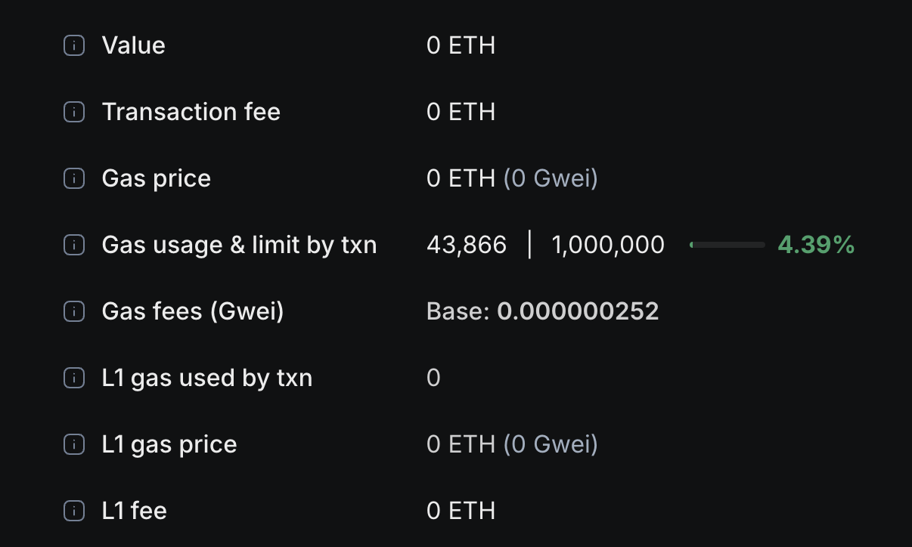

import { Callout } from 'nextra/components'

# Fees on Ink 

As a Superchain L2, the fee you pay for each transaction on Ink has two components: 
1. An execution fee for the chain you're on (i.e. Ink L2)
2. A security fee that helps secure the L2 by publishing L2 transactions to Ethereum (the L1)

The security fee is generally higher than the execution fee because L1 transactions tend to be more expensive. The L1 can be subject to congestion and other situations that lead to high gas fees and longer confirmation times. 

This is an example of fees from an Ink transaction via our [Block Explorer](https://explorer-sepolia.inkonchain.com/tx/0xaea0e302ed3f89eef77475c1821df67b3713b80798298469ecc3dbd4d8e14e5f): 

