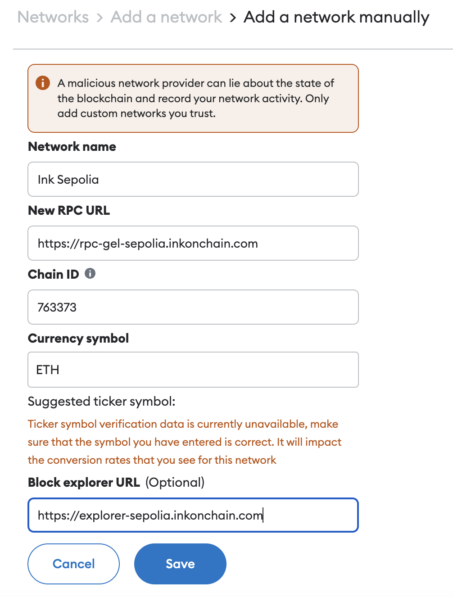

import { AddNetworkButton } from "../../components/AddNetworkButton";
import CopyableCode from '@/components/CopyableCode'

# Get Connected

The button below will add the Ink Sepolia network to your wallet:

<AddNetworkButton />

## Network Information

| Field                | Information                                                    |
| -------------------- | -------------------------------------------------------------- |
| Network Name         | Ink Sepolia                                                    |
| Description          | Ink's public testnet                                           |
| RPC Endpoint (HTTPS) | <CopyableCode code="https://rpc-gel-sepolia.inkonchain.com" /> |
| RPC Endpoint (WSS)   | <CopyableCode code="wss://ws-gel-sepolia.inkonchain.com" />    |
| Chain ID             | 763373                                                         |
| Currency Symbol      | ETH                                                            |
| Block Explorer       | https://explorer-sepolia.inkonchain.com                        |

## What do I Need to Start Developing on Ink?
1. An IDE (integrated developer environment) like [Visual Studio Code](https://code.visualstudio.com/), [Cursor](https://www.cursor.com), or [Remix](https://remix.ethereum.org/) to write smart contracts in solidity.
1. A wallet that holds ETH such as [Kraken Wallet](https://www.kraken.com/wallet), [MetaMask](https://metamask.io/), or [Rainbow](https://rainbow.me/).
    - We suggest having at least 0.05 ETH for standard deployments on Ink.
    - You can request Ink Sepolia ETH using our [Faucets](/quick-start/faucets).
1. We recommend using a development framework like [Foundry](https://book.getfoundry.sh/) or [Hardhat](https://hardhat.org/)
    - [Guide to deploy a contract using Foundry](/build/tutorials/deploying-a-smart-contract/foundry)
    - [Guide to deploy a contract using Hardhat](/build/tutorials/deploying-a-smart-contract/hardhat)
    - [Guide to deploy a contract using Remix](/build/tutorials/deploying-a-smart-contract/remix)

## Connecting to Ink

### Connecting MetaMask Wallet to Ink Sepolia (Testnet)
** Click the button at the top of the page to add the network to your wallet **

To manually add Ink Sepolia as a custom network do following:

    1. Open your MetaMask browser extension.
    2. Open the network selection dropdown menu by clicking the dropdown button at the top left of the extension.
    3. Click the "+ Add network" button at the bottom.
    4. A new window should open. Click "Add a network manually" at the bottom of the list.
    5. In the dialog that appears, enter the information listed in [Network Information](#network-information). See screenshot below.
    6. Click "Save".
    7. When clicking on the network selection dropdown you can now select Ink Sepolia to connect to.

Next: get some [testnet ETH](/quick-start/faucets) from our faucets!

###### Fund your Wallet
Get testnet Ether (ETH) from these faucets so you can fund your wallet to send transactions and deploy contracts on Ink Sepolia.

Check out faucets [here](/quick-start/faucets). Alternatively, you can [bridge](/quick-start/faucets#bridging-funds-to-ink-sepolia) testnet funds.

## What Next?
Check out the [tutorials](/build/tutorials/deploy-a-smart-contract-using/foundry) to learn how to deploy contracts on Ink and more!
